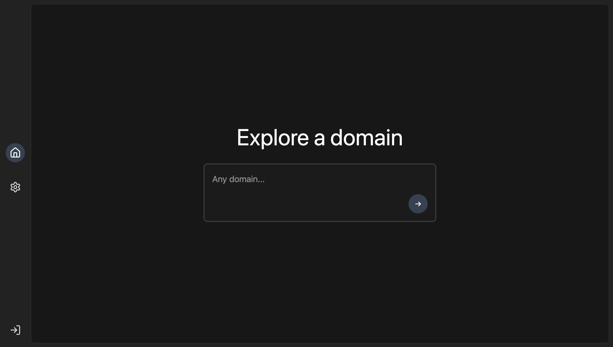
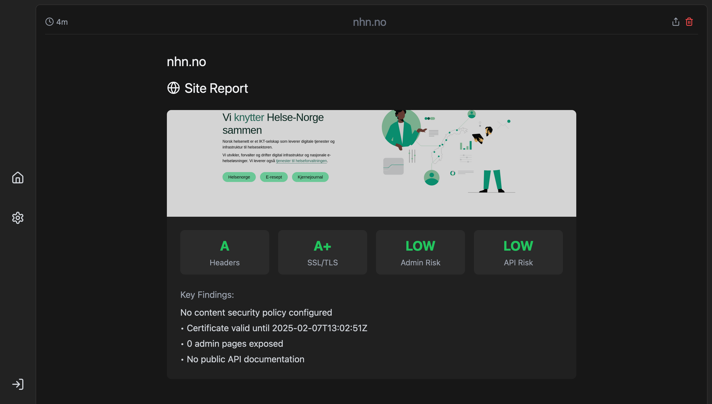

# CHASE
> Certificate Hunting & Security Enumeration



Tool to find security issues for a given domain.
It checks for:
- security headers
- certificate best practices
- screenshots of the domain over time
- exposure of admin pages
- exposure of swagger endpoints



## Get started
```bash
git clone https://github.com/NorskHelsenett/chase.git
cd chase
code .
```

## Devcontainer

Open with VSCode Devcontainer support

## Setup OIDC (optional)
Create an `.env` file,
```bash
cat <<EOF > /api/.env
OIDC_ISSUER_URL=
OIDC_CLIENT_ID=
OIDC_CLIENT_SECRET=
OIDC_REDIRECT_URL=http://localhost:5173/api/callback
EOF
```

## Run docker
```bash
docker volume create chase_data
docker run --rm -v chase_data:/data alpine chown -R 101:101 /data
docker run --rm -it -p 8888:8080 -v fit_data:/data chase
```

## Test docker-compose
```bash
curl -X POST http://localhost:8081/screenshot \
  -H "Content-Type: application/json" \
  -d '{"url": "https://example.com"}'
```

## Start debugging
F5 to start debugging golang

<details>
<summary>Scripts to get started</summary>

Create a script to push multiple hosts at once:
```bash
cat << EOF
#!/bin/bash

while IFS= read -r url; do
    if curl -X POST 'http://localhost:8080/api/servers' \
    -H 'Content-Type: application/json' \
    -d "{
        \"url\": \"$url\",
        \"active\": true,
        \"follow_redirect\": true,
        \"expected_status\": 200
    }"; then
        echo -e "\nSuccessfully processed: $url\n"
    else
        echo -e "\nError processing: $url\n" >&2
    fi
done
EOF > create_servers.sh
```

Then use it like:
```bash
chmod +x create_servers.sh
```

And mass insert domains with EOF:
```bash
cat << EOF | ./create_servers.sh
https://nhn.no
https://example.com
EOF
```

</details>
